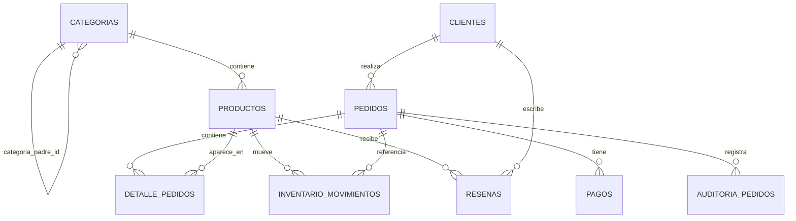

# Sistema de analítica para e-commerce (PostgreSQL)

Proyecto de SQL avanzado sobre un dominio de e-commerce: modelado
relacional normalizado, generación de datos de prueba con SQL puro,
CTEs recursivos y window functions.

## Stack

- **Motor:** PostgreSQL 16 (vía Docker)
- **Cliente SQL:** TablePlus
- **Infraestructura local:** `docker-compose.yml`

## Cómo levantar el entorno

```bash
docker compose up -d
docker ps   # confirmar que ecommerce_db está "Up"
```

Conexión (TablePlus u otro cliente):

- Host: `localhost`
- Port: `5432`
- User: `admin`
- Password: `admin123`
- Database: `ecommerce_analytics`

## Orden de ejecución de los scripts

1. `01_schema.sql` — tipos ENUM y las 8 tablas (en orden de dependencias)
2. `02_seed_data.sql` — datos de prueba (~500 clientes, 200 productos,
   2,000 pedidos, ~5,000 líneas de detalle, pagos, movimientos de
   inventario y reseñas)
3. `03_queries_analiticas.sql` — CTE recursivo y window functions
4. `04_triggers_procedures.sql` — reconciliación inicial de stock,
   trigger de actualización de stock y trigger de auditoría de
   cambios de estado en `pedidos`
5. `05_optimizacion.sql` — índices sobre columnas FK y análisis
   `EXPLAIN ANALYZE` antes/después

## Alternativa en Python

`scripts/generar_datos.py` reproduce el mismo dataset que
`02_seed_data.sql`, pero resolviendo la aleatoriedad en Python
(vía `Faker` + `psycopg2`) en vez de en el motor de la base de datos.
Útil para comparar ambos enfoques — ver la explicación paso a paso
en la conversación del proyecto.

```bash
cd scripts
pip install -r requirements.txt
python generar_datos.py
```

`tests/test_seed_data.py` verifica la integridad de los datos
generados (conteos, jerarquía de categorías sin ciclos, costo < precio,
totales que cuadran con el detalle, coherencia pago/estado, no
concentración en una sola categoría/cliente — la misma protección
contra el bug de InitPlan documentado en `notes.md`):

```bash
cd tests
pip install -r requirements.txt
pytest -v
```

## Modelo de datos

8 entidades, 2 relaciones N:M resueltas con tabla puente
(`detalle_pedidos` entre `pedidos`/`productos`, `resenas` entre
`productos`/`clientes`), el resto 1:N. `categorias` es autorreferente
para modelar una jerarquía de profundidad variable.

```
categorias (1) ──< (N) categorias            [self-reference]
categorias (1) ──< (N) productos
clientes   (1) ──< (N) pedidos
pedidos    (1) ──< (N) detalle_pedidos >── (N) productos
pedidos    (1) ──< (N) pagos
productos  (1) ──< (N) inventario_movimientos
productos  (1) ──< (N) resenas >── (N) clientes
```

### Diagrama ER



También disponible en `schema.dbml` para pegarlo en
[dbdiagram.io](https://dbdiagram.io) y obtener el diagrama visual
interactivo.

## Técnicas SQL demostradas

- Normalización 3FN, jerarquía autorreferente
- ENUM de Postgres vs. VARCHAR + CHECK (y cuándo usar cada uno)
- Generación de datos con `generate_series`, `random()`, `LATERAL`
- CTE recursivo (`WITH RECURSIVE`) para recorrer árbol de categorías
- Window functions: `RANK()`, running totals con `SUM() OVER`,
  `LAG()` para comparación mes a mes, `AVG() OVER (PARTITION BY ...)`
- `UPDATE ... FROM` con subquery agregada
- `DISTINCT ON` para deduplicar sin violar constraints `UNIQUE`
- Trigger functions en PL/pgSQL (`AFTER INSERT`, `AFTER UPDATE`,
  `OLD`/`NEW`, `IS DISTINCT FROM`) para lógica de negocio en la BD
- Índices sobre FKs y lectura de planes con `EXPLAIN ANALYZE`

## Optimización (`EXPLAIN ANALYZE` antes/después)

Postgres **no crea índices automáticamente sobre columnas FK**
(a diferencia de las PK, que sí quedan indexadas solo por ser
`PRIMARY KEY`). Antes de `05_optimizacion.sql`, cualquier filtro o
JOIN por `cliente_id`, `producto_id`, `pedido_id`, `categoria_id`,
etc. forzaba un `Seq Scan` completo.

Resultados medidos contra los datos reales del proyecto:

| Query | Antes | Después | Notas |
|---|---|---|---|
| `pedidos WHERE cliente_id = ?` | Seq Scan, 0.457 ms | Bitmap Heap Scan, 0.227 ms | ~2x más rápido |
| `detalle_pedidos WHERE producto_id = ?` | Seq Scan, 0.567 ms | Bitmap Heap Scan, 0.142 ms | ~4x más rápido |
| `productos WHERE categoria_id = ?` | Seq Scan, 0.054 ms | Seq Scan (sin cambio) | tabla de solo 3 páginas: el índice existe pero el planner lo ignora a propósito — más barato leer todo que usar el índice |
| Ranking por categoría (agregación completa) | Hash Join + Seq Scan, 4.5 ms | Sin cambio | la query necesita casi toda la tabla; un índice de igualdad no ayuda a agregaciones masivas |
| Ventas mensuales (`estado != 'cancelado'`) | Seq Scan, filtra solo 422 de 2000 filas | Sin cambio | filtro poco selectivo (79% de las filas matchean) — el índice en `estado` no se usa para esta condición |

Conclusión práctica: un índice no es "gratis" ni se usa solo porque
existe — el planner de Postgres es *cost-based* y decide según el
tamaño real de la tabla y la selectividad del filtro. El valor de
estos índices crece con el volumen de datos; a escala de producción
(millones de filas) evitan que los `Seq Scan` por FK se vuelvan
inviables. Detalle completo y comandos para reproducir cada medición
en `05_optimizacion.sql`.

## Retos técnicos resueltos

Ver `notes.md` para el detalle completo, en particular un bug real y
sutil del optimizador de Postgres (InitPlan tratando una subquery
aleatoria no correlacionada como constante) que rompió la
distribución de varias tablas y se corrigió con el patrón
`row_number() + JOIN` explícito.

## Licencia

[MIT](LICENSE)

